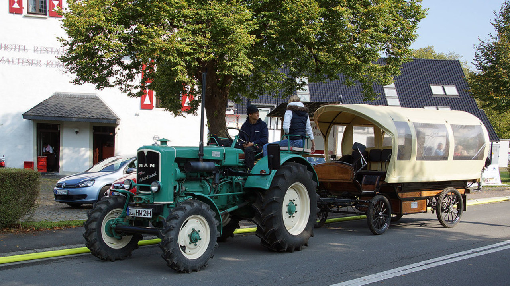
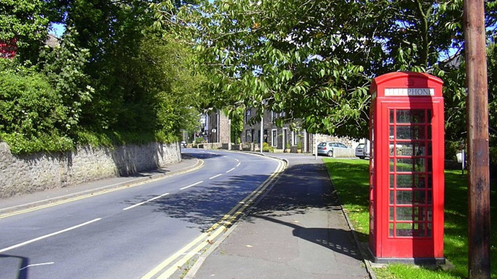
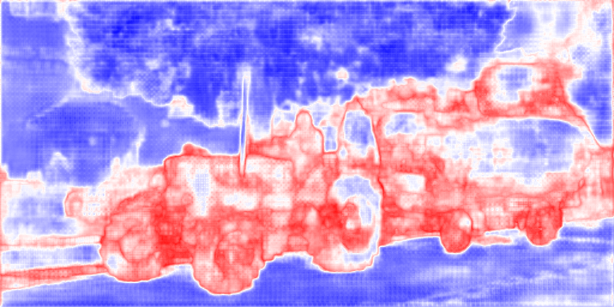
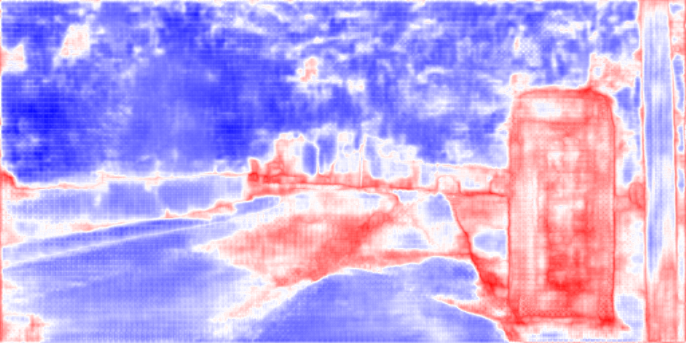

# Real-Time Anomaly Segmentation for Road Scenes
This repository contains the code of the __Real-Time Anomaly Segmentation for Road Scenes__ project of the __Advanced Machine Learning__ course 23/24 - Politecnico di Torino

This repository was built on the following repository base:  [erfnet_pytorch](https://github.com/Eromera/erfnet_pytorch). \
A brief overview of the project is available at [s326619_s330509_project4.pdf](s326619_s330509_project4.pdf).

### Sample Results
Example of Anomaly scores calculated by an ERFNet model using
the MaxLogit inference method.

#### Original Images 

#### Ground Truth Anomaly 

#### Anomaly Scores 

## Packages
For instructions, please refer to the __README__ in each folder:

* [train](train) contains tools for training the networks for semantic segmentation.
* [eval](eval) contains tools for evaluating/visualizing the networks' output and performing anomaly segmentation.
* [imagenet](imagenet) contains scripts and model for pretraining ERFNet's encoder in Imagenet.
* [trained_models](trained_models) contains some trained models used in the papers (almost all the models are available in the [Releases section](https://github.com/FarInHeight/Real-Time-Anomaly-Segmentation-for-Road-Scenes/releases/tag/v3.0.0)). 

## Datasets

* [**The Cityscapes dataset**](https://www.cityscapes-dataset.com/): Download the "leftImg8bit" for the RGB images and the "gtFine" for the labels. **Please note that for training you should use the "_labelTrainIds" and not the "_labelIds", you can download the [cityscapes scripts](https://github.com/mcordts/cityscapesScripts) and use the [conversor](https://github.com/mcordts/cityscapesScripts/blob/master/cityscapesscripts/preparation/createTrainIdLabelImgs.py) to generate trainIds from labelIds**
* **For testing the anomaly segmentation models**: All testing images are provided [here](https://drive.google.com/file/d/1r2eFANvSlcUjxcerjC8l6dRa0slowMpx/view).

## Networks
The repo provides the following pre-trained networks that can be used to perform anomaly segmentation:
* __Erfnet__ trained on 19 classes of the Cityscapes dataset using a __Cross-Entropy loss__, __Logit Norm + Cross Entropy__, __Logit Norm + Focal Loss__, __IsoMax+ + Cross Entropy__ and __IsoMax+ + Focal Loss__
* __BiSeNetV1__ trained on 20 classes (19 + void class) of the Cityscapes dataset
* __Enet__ trained on 20 classes (19 + void class) of the Cityscapes dataset

## Notebook
The `AML_Project.ipynb` can be opened on Colab to run all the evaluation commands.

## Authors

- [Davide Sferrazza s326619](https://github.com/FarInHeight/)
- [Davide Vitabile s330509](https://github.com/Vitabile/)

## License

Please refer to the following [repo](https://github.com/Eromera/erfnet_pytorch) and [license](https://github.com/Eromera/erfnet_pytorch?tab=License-1-ov-file#readme) for the use and modification of the material contained in the linked repository and modified in this repo.